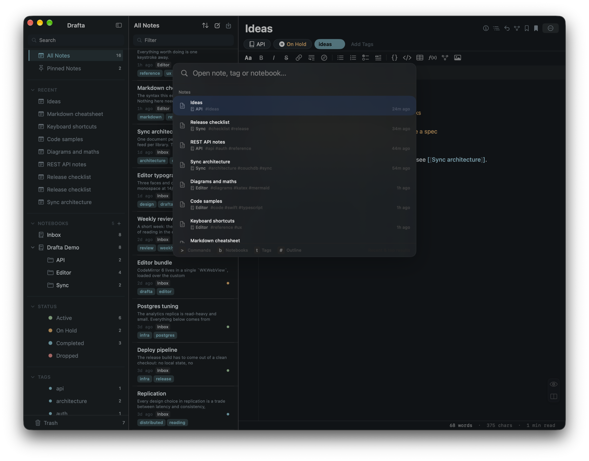
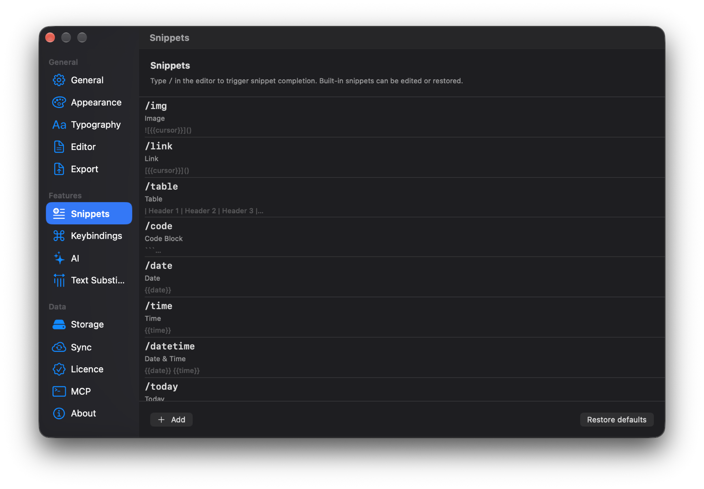
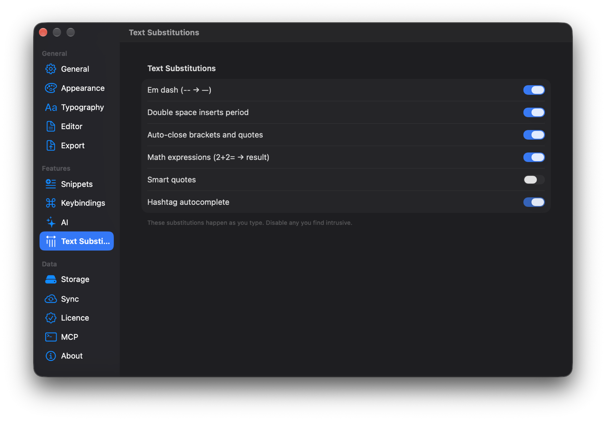

I write notes between two tasks in a code editor, so Drafta needs to respond to the keyboard as fast as an IDE. This article covers shortcuts, quick switcher, snippets, and text substitutions. How the library itself is structured is covered in the article [Notes are files: notebooks, tags, statuses, and links](/blog/zametki-eto-faily/).

## Quick switcher with ⌘P

⌘P opens the quick switcher panel. It's a fuzzy search across all notes: a few letters from the title are enough. The panel has four prefixes that narrow the search:

| Prefix | What it searches |
|---|---|
| `>` | app commands |
| `b ` | notebooks |
| `t ` | tags |
| `#` | headings within the open note |

Letter prefixes need a space after the letter, so the query `book` searches for a word, not notebooks.

*Quick switcher: notes with notebook, tags, and edit time, with hints for Commands, Notebooks, Tags, Outline at the bottom.*

## App shortcuts

| Shortcut | Action |
|---|---|
| ⌘N | new note in the current notebook |
| ⇧⌘N | new note from template |
| ⌘P | quick switcher |
| ⌘F | search in note |
| ⌘J | AI assistant |
| ⌥⌘L | show or hide the note list |
| ⌥⌘B | all bookmarks |
| ⇧⌘E | export |

Editor, preview, and split modes are switched with buttons — there is no separate shortcut for them.

## Editor shortcuts

Formatting commands work inside the note text:

| Shortcut | Action |
|---|---|
| ⌘B | bold |
| ⌘I | italic |
| ⇧⌘S | strikethrough |
| ⇧⌘M | highlight |
| ⌘E | inline code |
| ⌘K | link |
| ⇧⌘K | wiki link |
| ⌘1, ⌘2, ⌘3 | heading level one, two, three |
| ⇧⌘L | bulleted list |
| ⇧⌘O | numbered list |
| ⇧⌘X | task |
| ⇧⌘. | quote |
| ⇧⌘B | bookmark on line |
| ⌥↑, ⌥↓ | move line up or down |

In a table, Tab and ⇧Tab move between cells. Enter in a task list continues the list with a new task.

## A custom shortcut for any command

Editor shortcuts are reassigned in the Keybindings section of the settings. The Record button records a new shortcut, the arrow next to it restores a single default value, and Reset All to Defaults restores all at once. Footnotes, formulas, diagrams, and images have no default shortcuts — you can assign them yourself.

*Keybindings: each command has its own shortcut, a Record button, and reset.*

## Snippets via slash

A slash in the editor opens the snippet list. Drafta has 14 built-in ones:

- `/img`, `/link`, `/table`, `/code` — image, link, table, code block;
- `/h1`, `/h2`, `/h3`, `/quote`, `/task`, `/hr` — headings, quote, task, horizontal rule;
- `/date`, `/time`, `/datetime`, `/today` — current date and time.

In the snippet body, the variables `{{cursor}}` work — where the cursor will land, `{{date}}` and `{{time}}`. Built-in snippets can be edited, the Add button adds your own, and Restore defaults returns the original set.

*Snippets: each snippet has a trigger, a name, and a body with variables.*

> [!TIP]
> Type `/today` in an empty note — you get today's date in bold and the cursor on the line below. Handy for a journal.

## Text substitutions while typing

The Text Substitutions section collects replacements that trigger right as you type:

- two hyphens turn into an em dash;
- a double space inserts a period;
- brackets and quotes close automatically;
- an expression like `2+2=` is replaced with the result;
- typographic quotes;
- tag autocomplete after a hash.

Each substitution can be turned off individually if it gets in the way.

*Text Substitutions: six replacements, each turned off with its own toggle.*

One shortcut from the table deserves its own article — ⌘J opens the AI assistant. But first, about how Drafta stores edit history.
