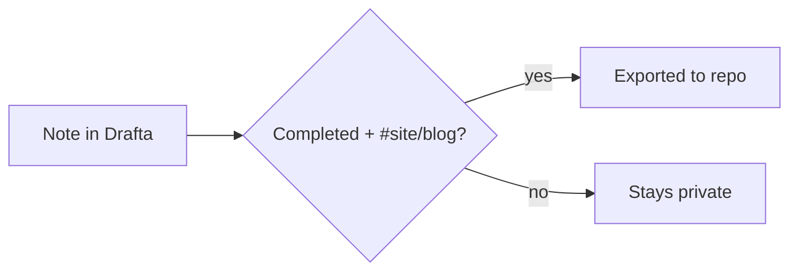

This is a fixture post for **ЗАДАЧА-2.0**: it proves the `blog` content
collection resolves, callouts render, and mermaid diagrams work — the actual
post design and layout arrive in wave 2.1.

> [!NOTE]
> This is a callout. `remark-callouts.mjs` turns this blockquote into an
> `<aside class="callout callout--note">`.

Here is how a note travels from Drafta to the site[^1]:



And a plain code block, which must not be mistaken for a diagram:

```js
export function hello() {
  return "hello from the fixture post";
}
```

[^1]: The publishing pipeline is built in a later task (2.4).
