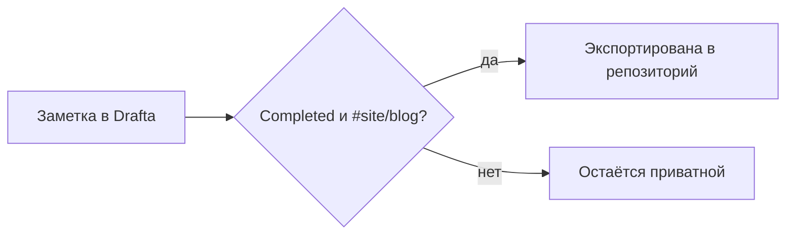

Это фикстурный пост для **ЗАДАЧА-2.0**: он доказывает, что коллекция `blog`
резолвится, callout рендерится, а диаграммы mermaid работают — дизайн и
вёрстка поста появятся в волне 2.1.

> [!NOTE]
> Это callout. `remark-callouts.mjs` превращает такую цитату в
> `<aside class="callout callout--note">`.

Вот как заметка попадает с Drafta на сайт:

